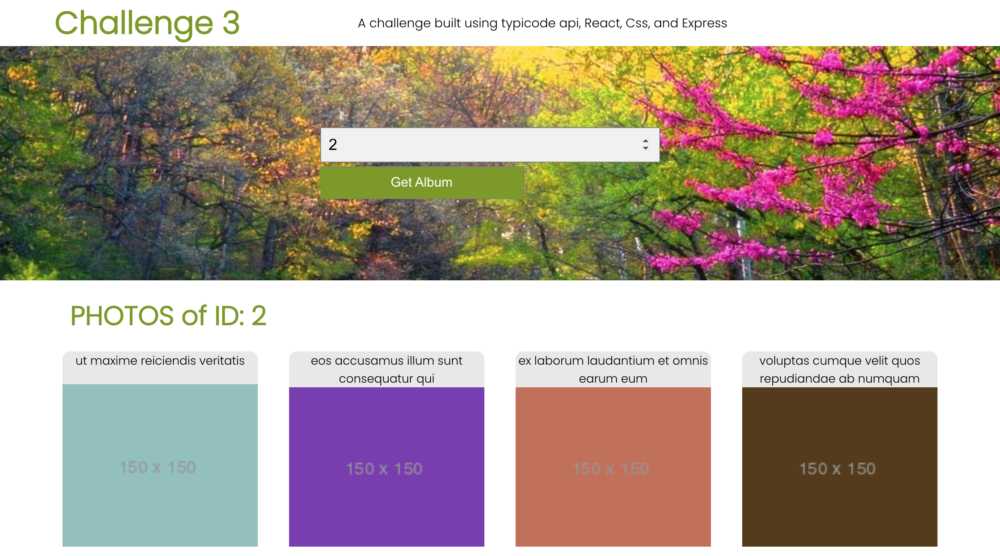

# Challenge 3

This is a follow up to challenge 2. Instead of making an api call when a user clicks the submit button, I used an endpoint I created using ExpressJS and NodeJS to get album Photos. The endpoint calls the api and returns to the frontend a list of albums photos with only titles and thumbnailurl. 

## ScreenShot

